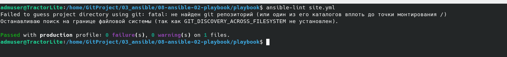
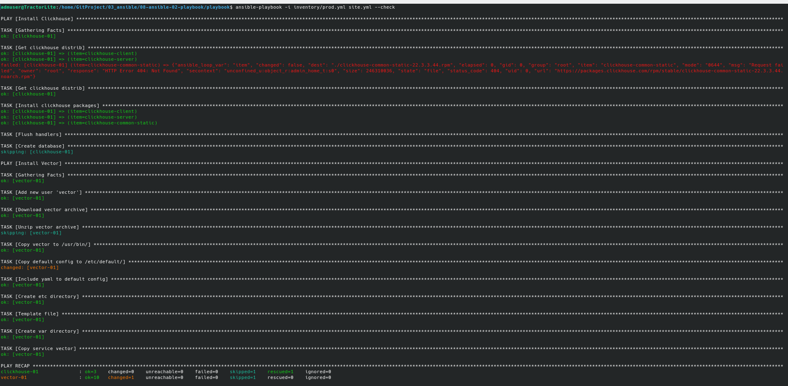

## <p style="text-align: center;">ОТЧЕТ</p> <p style="text-align: center;">по домашним заданиям к занятию «Работа с Playbook»</p>
## <p style="text-align: right;">Выполнил: студент Порсев И.С.</p>

## Подготовка к выполнению

1. * Необязательно. Изучите, что такое [ClickHouse](https://www.youtube.com/watch?v=fjTNS2zkeBs) и [Vector](https://www.youtube.com/watch?v=CgEhyffisLY).
2. Создайте свой публичный репозиторий на GitHub с произвольным именем или используйте старый.
3. Скачайте [Playbook](./playbook/) из репозитория с домашним заданием и перенесите его в свой репозиторий.
4. Подготовьте хосты в соответствии с группами из предподготовленного playbook.

## Основная часть

1. Подготовьте свой inventory-файл `prod.yml`.
2. Допишите playbook: нужно сделать ещё один play, который устанавливает и настраивает [vector](https://vector.dev). Конфигурация vector должна деплоиться через template файл jinja2. От вас не требуется использовать все возможности шаблонизатора, просто вставьте стандартный конфиг в template файл. Информация по шаблонам по [ссылке](https://www.dmosk.ru/instruktions.php?object=ansible-nginx-install). не забудьте сделать handler на перезапуск vector в случае изменения конфигурации!
3. При создании tasks рекомендую использовать модули: `get_url`, `template`, `unarchive`, `file`.
4. Tasks должны: скачать дистрибутив нужной версии, выполнить распаковку в выбранную директорию, установить vector.
5. Запустите `ansible-lint site.yml` и исправьте ошибки, если они есть.
6. Попробуйте запустить playbook на этом окружении с флагом `--check`.
7. Запустите playbook на `prod.yml` окружении с флагом `--diff`. Убедитесь, что изменения на системе произведены.
8. Повторно запустите playbook с флагом `--diff` и убедитесь, что playbook идемпотентен.
9. Подготовьте README.md-файл по своему playbook. В нём должно быть описано: что делает playbook, какие у него есть параметры и теги. Пример качественной документации ansible playbook по [ссылке](https://github.com/opensearch-project/ansible-playbook). Так же приложите скриншоты выполнения заданий №5-8
10. Готовый playbook выложите в свой репозиторий, поставьте тег `08-ansible-02-playbook` на фиксирующий коммит, в ответ предоставьте ссылку на него.

---

### <div style="text-align: center;">Решение</div>
Порядок установки пакета Vector следующий:
1. Добавление пользователя под которым будет запускаться пакет Vector 
``` terraform
ansible.builtin.user:
    name: "vector"
    state: present
    shell: "/sbin/nologon"
```
2. Загрузка с сайта архива с пакетом Vector 
``` terraform
ansible.builtin.get_url:
    url: "https://packages.timber.io/vector/{{ vector_version }}/vector-{{ vector_version }}-{{ vector_arch }}-unknown-linux-gnu.tar.gz"
    dest: "/tmp/vector-{{ vector_version }}-{{ vector_arch }}-unknown-linux-gnu.tar.gz"
    mode: '0644'
```
3. Распаковка архива с пакетом Vector 
``` terraform
ansible.builtin.unarchive:
    remote_src: true
    src: "/tmp/vector-{{ vector_version }}-{{ vector_arch }}-unknown-linux-gnu.tar.gz"
    dest: "/tmp/"
```
4. Копирование пакета Vector в директорию `/usr/bin/`
``` terraform
ansible.builtin.copy:
    remote_src: true
    src: "/tmp/vector-{{ vector_arch }}-unknown-linux-gnu/bin/vector"
    dest: "/usr/bin/"
    mode: '0755'
```
5. Копирование конфигурации пакета Vector
``` terraform
ansible.builtin.copy:
    remote_src: true
    src: "/tmp/vector-{{ vector_arch }}-unknown-linux-gnu/etc/systemd/vector.default"
    dest: "/etc/default/vector"
    mode: '0644'
```
6. Добавление файла обработки в пакет Vector
``` terraform
ansible.builtin.lineinfile:
    path: /etc/default/vector
    line: "VECTOR_CONFIG_YAML=/etc/vector/config.yaml"
```
7. Создание директории `/etc/vector` для правил обработки
``` terraform
ansible.builtin.file:
    path: "/etc/vector"
    state: directory
    mode: "0755"
```
8. Копирование правил обработки
``` terraform
ansible.builtin.copy:
    remote_src: true
    src: "/tmp/vector-{{ vector_arch }}-unknown-linux-gnu/config/vector.yaml"
    dest: /etc/vector/config.yaml
    mode: '0644'
```
9. Создание директории `/var/lib/vector` для работы пакета Vector
``` terraform
ansible.builtin.file:
    path: "/var/lib/vector"
    state: directory
    mode: "0777"
```
10. Копирование файла сервиса Vector с последующим запуском
``` terraform
ansible.builtin.copy:
    remote_src: true
    src: "/tmp/vector-{{ vector_arch }}-unknown-linux-gnu/etc/systemd/vector.service"
    dest: "/lib/systemd/system/"
    mode: '0755'
```

>по пункту 5
    

>по пункту 6
 

>по пунктам 7-8
 

# Ссылки на файлы:
>[site](./site.yml);    
>[vars vector](./group_vars/vector/vars.yml);    

